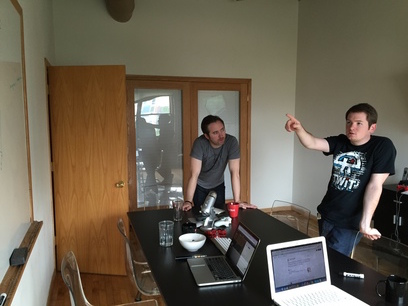
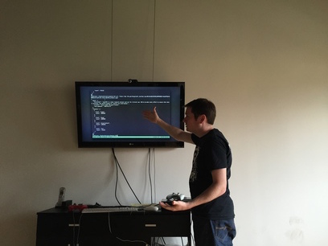
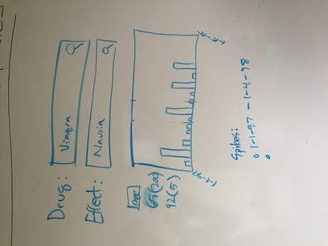

# Process

## Leadership

For Team NISH, authority, responsibility, and accountability for project quality was the purview of the project manager.

We assigned a product manager for Qui℞ prototype. The primary responsibility of the product manager was Qui℞ prototype health. Throughout the development of Qui℞ prototype, our product manager ensured that everyone was heard and all roadblocks were communicated as early as possible. They gathered questions from the development team and retrieved answers from the client.

## Team

We assembled a multidisciplinary team comprised of [Mukesh Dalal](https://www.linkedin.com/in/mdalal) as Product Manager, [Brian Dunn](http://hashrocket.com/team/brian-dunn) and [Dillon Hafer](https://www.dillonhafer.com/about) as developers.

The development pair shared full-stack responsibilities, including:

* Technical Architect
* Frontend Web Developer
* Backend Web Developer
* DevOps Engineer

## Approach

### Kickoff

We used an agile approach in solving this problem. The first challenge was to define the feature set. For this we first assigned a collegue the role of stakeholder. Then we held a story-carding session where we reviewed the FDA challenge and brainstormed a solution.

This process was informed by exploring the capabilities of the Open FDA API. We read some documentation, then dug in with curl.

We chose to develop a tool that allows users to search for peaks in adverse event reports. The first iteration of the user interface was a whiteboard sketch.

Once we had a general idea of the direction we wanted to go, it was time to capture some user stories. We did this with [Pivotal Tracker](https://www.pivotaltracker.com/n/projects/1370420). Follow that link to see what we came up with.

### Iterate

Each morning we held a brief stand-up meeting to ensure we were working on the most important things.

As the project began to take shape over the next couple of days, we relied on feedback from our appointed stakeholder to shape the priorities and direction we took. For example, we had a story about highlighting the peaks of charts. After our stakeholder saw the data, he realised that the peaks were apparent without highlighting. We were able to change direction and focus our attention on the things that mattered most to our stakeholder.

## Monitoring

We are using [NewRelic](http://newrelic.com) to continuously monitor this project's performance. Currently this only covers the performance of the prototype API layer. We developed, but have not implemented, a strategy to include the frontend asset serving in our monitoring.
